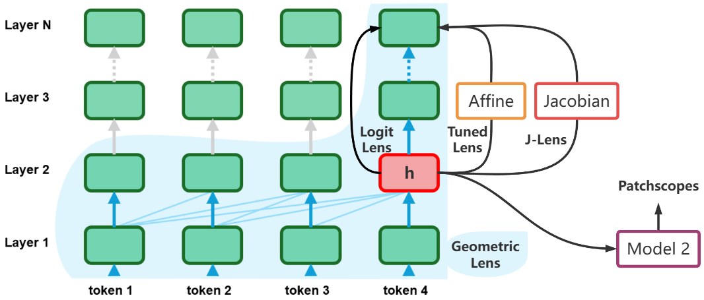

In this figure, different lenses decipher the hidden representation "h" at Layer 2, token 4, using different transformations:
* Logit Lens directly uses "h" to replace the final representation, and sends it to the unembedding layer.
* Patchscopes sends "h" to another model, "Model 2".
* Tuned Lens uses a separate dataset to learn an affine mapping to bridge "h" and the final representation.
* Jacobian Lens uses an average Jacobian matrix instead of the learned affine mapping. 
* Our Geometric Lens lets "h" flow inside a static tree until the final layer.

[← return to article](../)