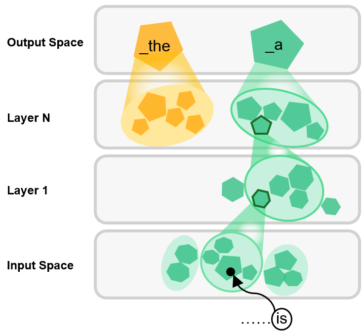

Piecewise-linear space subdivision at each layer of an LLM. A region in layer l corresponds to many regions in its lower layer (l−1), forming a tree structure. The input "is" falls into the bottom-most region of "\_a" in the embedding space, causing the next prediction to be "\_a".

[← return to article](../)