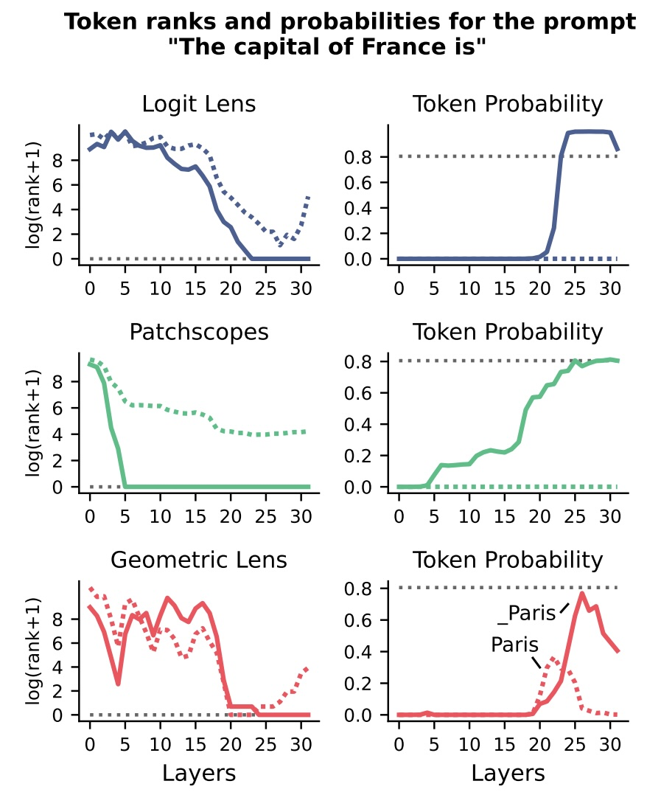

Log rank (left column) and probability (right column) of the two tokens \_Paris (solid lines) and Paris (dotted lines), elicited by three lenses: Logit Lens, Patchscopes, and Geometric Lens. Geometric Lens is the only lens that detects both the factually correct token Paris and the switching phase between \_Paris and Paris.

[← return to article](../)