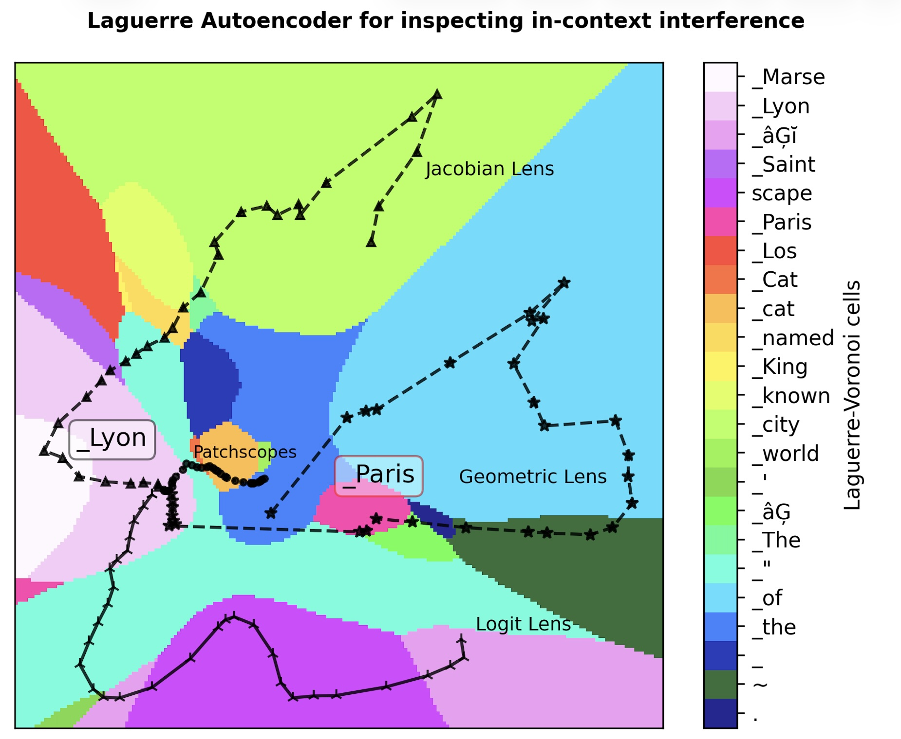

Joint visualization of decision regions and reasoning trajectories produced by four lenses for the prompt "*You are in a fictional world where Marseille and Lyon have swapped their names. The Louvre Museum is located in the city of*".

[← return to article](../)